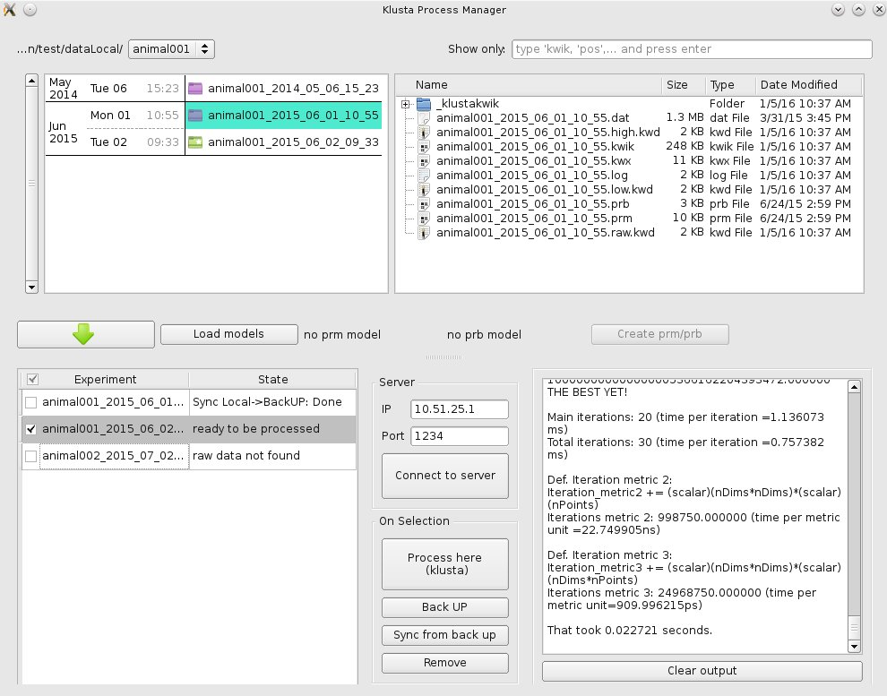

User interface around [Klusta suite](http://klusta-team.github.io/), an open-source software for neuroscience.

New Features (25/11/2015):
------------

- Open files with double click (in the top right view)
    - kwik files are opened with klustaviewa
    - you can close the application, even if you opened file through it (= it
  won't close klustaviewa if you close the app)

- In the bottom left view, right click on an experiment to see a menu:
     - experiment "waiting to be.." -> "cancel" button
     - experiment "klusta running" -> "kill" button (kill klusta, don't ask confirmation)
     - other -> no menu
     
- When processing on the server: once everything is sync to the back-up
(experiment are "waiting to be processed", or running), you can close the
application. Open it later and reconnect to the server to see the progress.

- Can manage different time format for folder's name:  
    in userConfig, you can put
    dateTime_format=["yyyy_MM_dd_HH_mm","yyyy-MM-dd_HH-mm-ss"] to have both
    the regular format and the openephys format

- On server side:  
    - don't delete .dat file if klusta crash
    - "kill" button reimplemented

Requirements
------------

Python 3.4 and PyQt4 (already in Anaconda)  
Should also work with Python2.7

With Miniconda or Anaconda install, do:
> conda update conda
> conda update pyqt

Install
-------

1) Download source folder

2) In a terminal, in the application's folder (where there is a setup.py file):

    > python setup.py install
    > sudo python create_shortcut.py

3) The install should have created a folder "processManager" in your home.
Inside, you'll find a file **userConfig.json** where you can **change default
parameters**.

In this folder, the application is also going to save data in small .db or
.save files. If you encounter bugs, you can try to delete those files and
restart the application.
For now, a database (.db) is created for a given path_to_data and
path_to_back_up. An experimentListServer.save is created if you close the app
while processing experiments and the server.

To launch
-----

In a terminal, anywhere:

    > klusta_process_manager

New: shortcut in the menu     
All Applications>applications>klusta_process_manager  

NB: you can put a shortcut on the desktop, but not on the task bar ("show a launcher when not running" doesn't work)

RSync
----

Synchronisation between local data and back-up is made with command line
rsync. The arguments of rsync are in appFolder/config/config.py, end of the
file. You can change them but you need to re-install the app after any change
for it to be effective.

By default, three different rsync lines:

- From local to back-up: `rsync -rlzutO`

- From back-up to local: `rsync -rlzutO --exlude=*dat`

- From back-up to computer server:

        rsync -rlzutO --prune-empty-dirs --include */ --include=*.prm --include=*.prb --include=*.dat --exclude=*

Server
------
Parameters in config.py  
PORT=1234  
IP=10.51.101.61  

To launch the server

    >klusta_server
